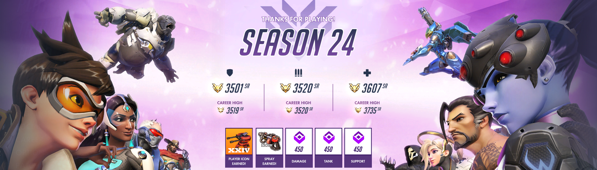
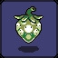

## Hello~  👋 

**Here is**
***me***
**!**
- 🔭 I’m currently working on works.
- 🌱 I’m currently learning with learning materials.
- 👯 I’m looking to collaborate with collaborators.
- 💬 Ask me about what you want to ask.
- 📫 How to reach me: to reach somewhere I reach.
- 😄 Fun facts are very funny.

<br>

✏️ **Hobbies**  

🎹 🎲 🎮 🍳 🏸 🎱 🐺 📚 🎬
<br><br>

💡 **Check me out on**  

<a href="https://space.bilibili.com/13486361" target="_blank" alt="bilibili" title="bilibili">

</a> 

<br>


**Languages and Frameworks**

<code></code>
<code></code>
<code></code>
<code></code>
<code></code>

**Tools and Environments**


<code></code>
<code></code>
<code></code>
<code></code>
<code></code>
<code></code>
<br>
<br>

📊 **This Week I Spent My Time On:**
<!--START_SECTION:waka-->
```text
Rest     167 hrs 59 mins   ██████████████████████████████████████   99.99 % 
Work     1 mins            ░░░░░░░░░░░░░░░░░░░░░░░░░░░░░░░░░░░░░░   00.01 % 
```
<!--END_SECTION:waka-->

✨ **Achievements**

Overwatch 🌈 🎖️
<br>
 <p>
   &nbsp;
 
  </p>
<br>

Clash Royale 👑 🎖️
<br>
 <p>
 
 
  </p>
<br>
<br><br>
Celeste 🍓 🥇
<br>
<p>
 


 
 </p>
<br>
<br>

Hollow Knight 🗡️ 🥈
<br>
 <p>
 


 
</p>
<br><br>

Getting over it with bennett foddy 🔨 🥉
<br>
 <p>
 
 
 </p>
<br><br>


🚧 **My Stats:**


❤️ Reinforcement learning   ❤️ Meta-learning

💔 Bayes
