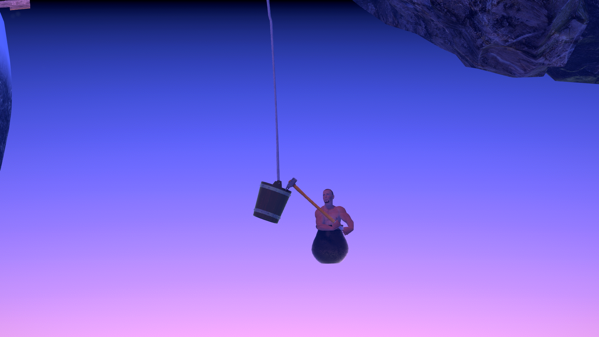
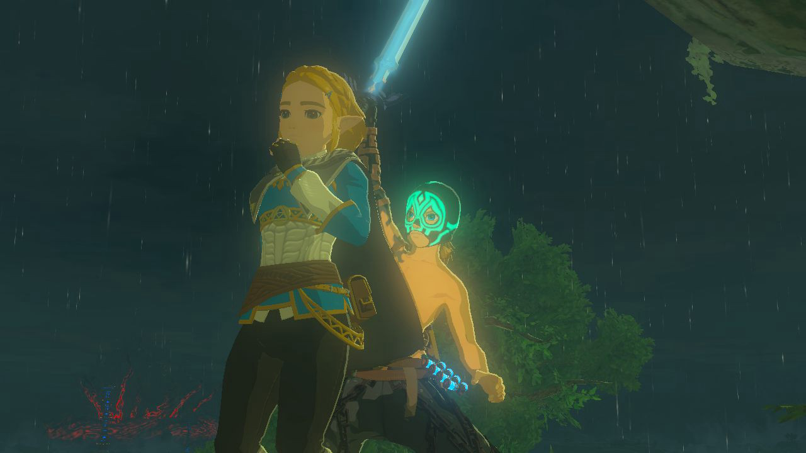
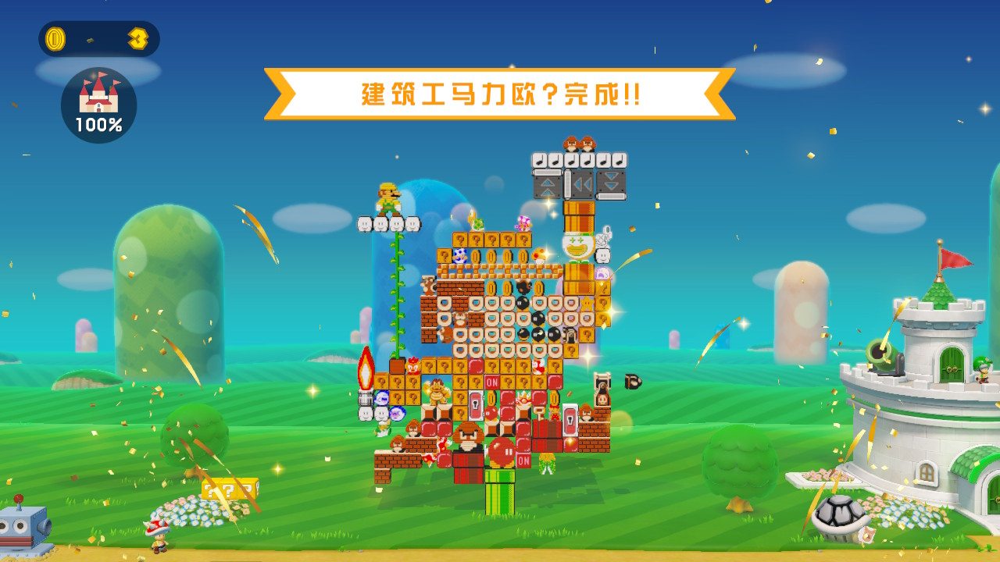
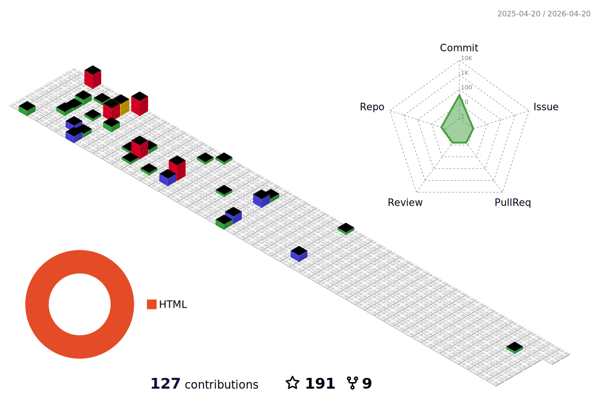

## Hello~    

 


**Here is**
***me***
**!**

- 🔭 I’m currently working on works.

- 🌱 I’m currently learning with learning materials.

- 👯 I’m looking to collaborate with collaborators.

- 💬 Ask me about what you want to ask.

- 📫 How to reach me: to reach somewhere I reach.

- 😄 Fun facts are very funny.

[//]: # (<table style="border-collapse: collapse; width: 90%; border: 0;">)

[//]: # (  <tr>)

[//]: # (    <td style="border: 0; width: 70%;">)

[//]: # (      <b>Here is</b>)

[//]: # (      <i>me</i>)

[//]: # (      <b>!</b><br>)

[//]: # (      - 🔭 I’m currently working on works.<br>)

[//]: # (      - 🌱 I’m currently learning with learning materials.<br>)

[//]: # (      - 👯 I’m looking to collaborate with collaborators.<br>)

[//]: # (      - 💬 Ask me about what you want to ask.<br>)

[//]: # (      - 📫 How to reach me: to reach somewhere I reach.<br>)

[//]: # (      - 😄 Fun facts are very funny.<br>)

[//]: # (    </td>)

[//]: # (    <td align="right" style="border: 0; width: 30%;">)

[//]: # (      )

[//]: # (    </td>)

[//]: # (  </tr>)

[//]: # (</table>)


### 💡 Check me out:

<a href="https://space.bilibili.com/13486361" target="_blank" alt="bilibili" title="bilibili">

</a> 

<br/>


### 🏅 Achievements:

- Owner of the 2024 Thomas Cup men's singles champion's same color grip tape *(2024年汤姆斯杯男子单打冠军选手同颜色手胶拥有者)*.

- Contestant of the 2023 National Chess Premier League men's champion's same chess software in the live stream *(2023全国象棋男子甲级联赛总冠军直播常用的象棋软件使用者)*.

- Player of the 2023 Chopin International Piano Competition participant's same number of keys musical instrument *(2023年肖邦国际钢琴比赛等数量琴键演奏者)*.

### ⚡️ Ultimate GitHub Challenge:

<a href="https://git.io/typing-svg"></a>


### 📊 This Week I Spent My Time On:
<!--START_SECTION:waka-->
```text
Rest     167 hrs 59 mins   ██████████████████████████████████████   99.99 % 
Work     1 mins            ░░░░░░░░░░░░░░░░░░░░░░░░░░░░░░░░░░░░░░   00.01 % 
```
<!--END_SECTION:waka-->


### ✨ Favourites:

[//]: # (#### Overwatch 🌈 🎖️)
<div style="display: flex; justify-content: center; align-items: center; flex-wrap: wrap;">
    
    
    
    
    
</div>


[//]: # (https://juejin.cn/post/7255184207243214906)

[//]: # (<div style="display: flex; flex-wrap: wrap; justify-content: space-around; align-items: flex-start;">)

[//]: # (    )

[//]: # (    )

[//]: # (</div>)




<div style="display: flex; justify-content: center; align-items: center; flex-wrap: wrap;">
    
</div>
