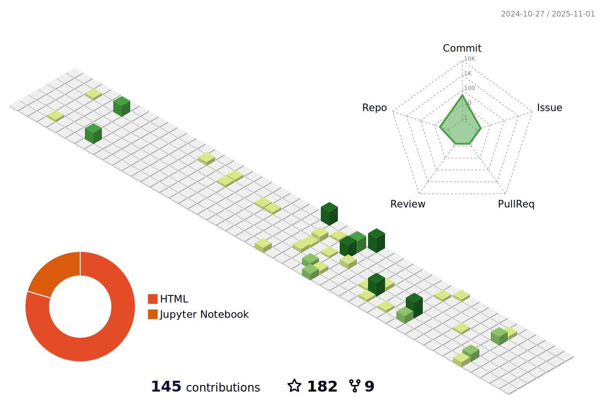

## Hello~    

[//]: # ()

[//]: # (**Here is**)

[//]: # (***me***)

[//]: # (**!**)

[//]: # (- 🔭 I’m currently working on works.)

[//]: # (- 🌱 I’m currently learning with learning materials.)

[//]: # (- 👯 I’m looking to collaborate with collaborators.)

[//]: # (- 💬 Ask me about what you want to ask.)

[//]: # (- 📫 How to reach me: to reach somewhere I reach.)

[//]: # (- 😄 Fun facts are very funny.)

<table style="border-collapse: collapse; width: 90%; border: 0;">
  <tr>
    <td style="border: 0; width: 90%;">
      <b>Here is</b>
      <i>me</i>
      <b>!</b><br>
      - 🔭 I’m currently working on works.<br>
      - 🌱 I’m currently learning with learning materials.<br>
      - 👯 I’m looking to collaborate with collaborators.<br>
      - 💬 Ask me about what you want to ask.<br>
      - 📫 How to reach me: to reach somewhere I reach.<br>
      - 😄 Fun facts are very funny.<br>
    </td>
    <td align="right" style="border: 0; width: 10%;">
      
    </td>
  </tr>
</table>


### 💡 Check me out:

<a href="https://space.bilibili.com/13486361" target="_blank" alt="bilibili" title="bilibili">

</a> 

<br/>


### ⚡️Ultimate GitHub Challenge:

<a href="https://git.io/typing-svg"></a>


### 📊 This Week I Spent My Time On:
<!--START_SECTION:waka-->
```text
Rest     167 hrs 59 mins   ██████████████████████████████████████   99.99 % 
Work     1 mins            ░░░░░░░░░░░░░░░░░░░░░░░░░░░░░░░░░░░░░░   00.01 % 
```
<!--END_SECTION:waka-->


### ✨ Favourites:

[//]: # (#### Overwatch 🌈 🎖️)
<div style="display: flex; justify-content: center; align-items: center; flex-wrap: wrap;">
    
    
</div>


### 🚧 My Status:

[//]: # (https://juejin.cn/post/7255184207243214906)

[//]: # (<div style="display: flex; flex-wrap: wrap; justify-content: space-around; align-items: flex-start;">)

[//]: # (    )

[//]: # (    )

[//]: # (</div>)




<div style="display: flex; justify-content: center; align-items: center; flex-wrap: wrap;">
    
</div>
